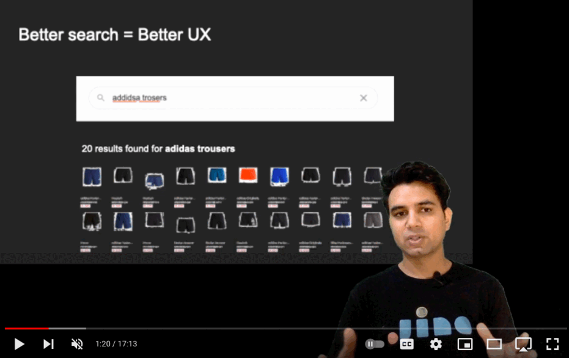

<!-- title -->

<!--lint ignore no-dead-urls-->
# Awesome Neural-Search  

<!-- subtitle -->

Awesome list of  Neural Search related resources, tools and projects

<!-- image -->

<!--  -->

<!-- description -->

Neural Network powered search is called Neural Search. It brings breakthrough use cases that were not possible by simple Rules or Statistics based search.
  
  
  

<!-- TOC -->

## Contents

- [Courses](#courses)
- [Research Papers](#research-papers)
- [Open-Source Tools](#open-source-tools)
- [Showcase](#showcase)
- [People To Follow](#people-to-follow)

<!-- CONTENT -->

## Courses

- [Introduction to Neural Search](https://cloudxlab.com/assessment/playlist-intro/1196/introduction-to-neural-search) - A bite-sized course

## Research Papers

- [Neural Ranking Models for Information Retrieval](https://arxiv.org/abs/1903.06902)

## Open-Source Tools

- [Jina](https://github.com/jina-ai/jina/) - A Python-based Neural Search framework
- [Weaviate](https://github.com/semi-technologies/weaviate) - A Golang-based vector search engine
- [DocArray](https://github.com/jina-ai/docarray) - A Python package to provide data structure for unstructured data
- [Finetuner](https://github.com/jina-ai/finetuner) - A Python package to finetune neural network for search applications
- [CLIP-as-service](https://github.com/jina-ai/clip-as-service) - A Python package to embed images and sentences into fixed-length vectors with CLIP

## Standards

- [OpenSearch](https://github.com/dewitt/opensearch) - A collection of simple formats for the sharing of search results

## Showcase

[Share your Neural Search projects](contributing.md)

<!-- END CONTENT -->

## People To Follow

<!-- list people worth following on social sites (Twitter, LinkedIn, GitHub, YouTube etc.) -->

- [Han Xiao](https://twitter.com/hxiao) - Founder of Jina AI
- [Bob van Luijt](https://twitter.com/bobvanluijt) - Founder of Semi Technologies

## Contributing

[Contributions of any kind welcome, just follow the guidelines](contributing.md)!

### Contributors

[Thanks goes to these contributors](https://github.com/gitcommitshow/awesome-neural-search/graphs/contributors)!
